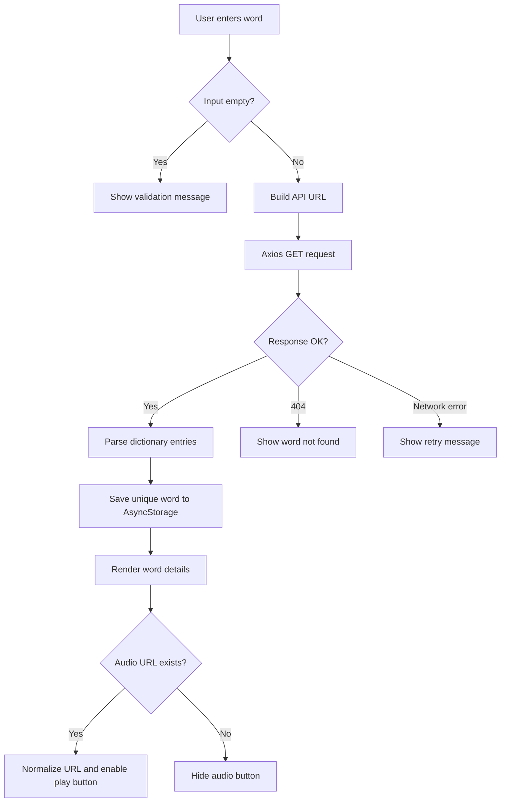
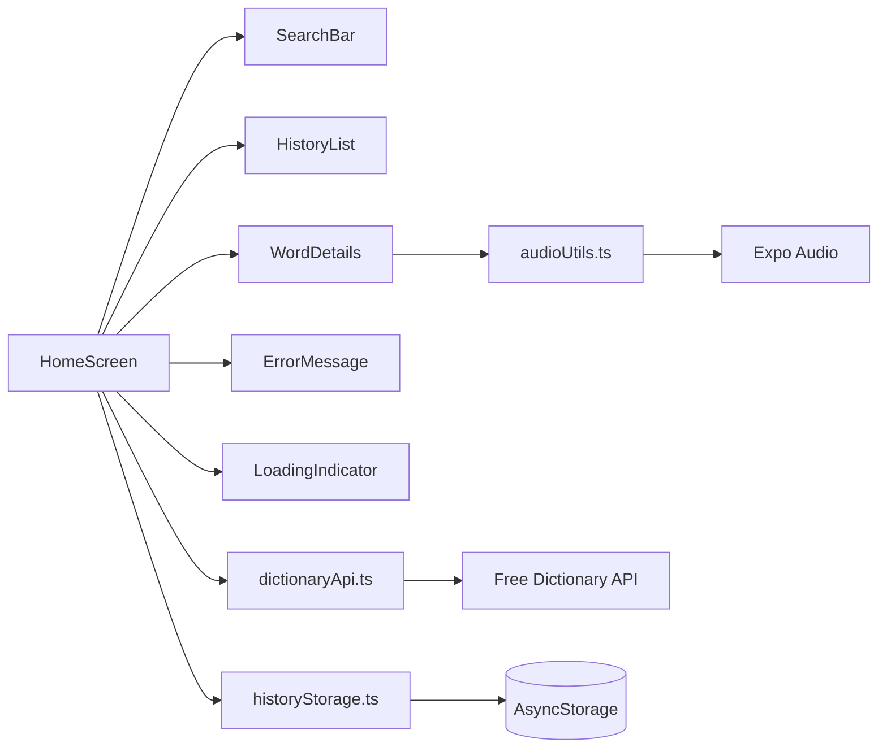

# Dictionary Mobile App

A clean cross-platform React Native dictionary app built with Expo Router, Axios, Expo Audio, and AsyncStorage. It searches the Free Dictionary API, displays meanings and examples, plays pronunciation audio when available, and keeps recent searches locally.

## Setup

```bash
npm install
npx expo start
```

Use the Expo CLI prompt to open Android, iOS, or web.

## Scripts

```bash
npm run android
npm run ios
npm run web
npm run lint
```

## API

The app calls:

```text
https://api.dictionaryapi.dev/api/v2/entries/en/{word}
```

## Pages/Screens

- `HomeScreen`: search input, recent history, loading/error/empty states, word details, and audio playback.

## Entities/Models

- `DictionaryEntry`: word, phonetic text, phonetics, meanings, and source URLs.
- `DictionaryPhonetic`: phonetic spelling and optional audio URL.
- `DictionaryMeaning`: part of speech and definitions.
- `DictionaryDefinition`: definition text, optional example, synonyms, and antonyms.
- `SearchHistory`: locally persisted list of unique recent words.

## Flow Diagram



## Architecture Diagram



## Project Structure

```text
src/
  api/dictionaryApi.ts
  app/_layout.tsx
  app/index.tsx
  components/ErrorMessage.tsx
  components/HistoryList.tsx
  components/LoadingIndicator.tsx
  components/SearchBar.tsx
  components/WordDetails.tsx
  screens/HomeScreen.tsx
  storage/historyStorage.ts
  types/dictionary.ts
  utils/audioUtils.ts
```
