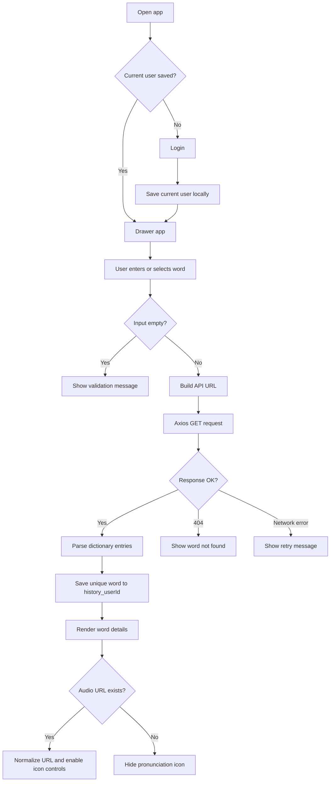
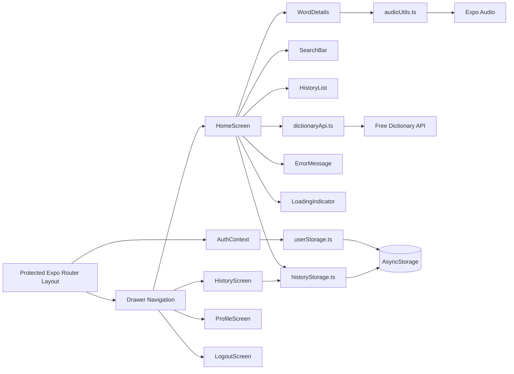

# LexiTech Dictionary

A clean cross-platform React Native dictionary app built with Expo Router, Drawer navigation, Axios, Expo Audio, Vector Icons, and AsyncStorage. It searches the Free Dictionary API, displays meanings and examples, plays pronunciation audio when available, and keeps user-specific recent searches locally.

Local authentication is included for demo/school use only. Authorized users are loaded from `src/data/users.json`, and the current logged-in user is stored in AsyncStorage on the device. This is not secure for production.

## Setup

```bash
npm install
npx expo start
```

Use the Expo CLI prompt to open Android, iOS, or web.

## Scripts

```bash
npm run android
npm run ios
npm run web
npm run lint
```

## API

The app calls:

```text
https://api.dictionaryapi.dev/api/v2/entries/en/{word}
```

## Pages/Screens

- `LoginScreen`: validates local credentials and saves the current user in AsyncStorage.
- `HomeScreen`: search input, recent history row, loading/error/empty states, word details, and audio playback.
- `HistoryScreen`: full per-user search history list with select and clear actions.
- `ProfileScreen`: current local account details and demo-auth warning.
- `LogoutScreen`: clears the current logged-in user.

## Entities/Models

- `LocalUser`: unique ID, username, password, and full name from the local authorized-users JSON file.
- `DictionaryEntry`: word, phonetic text, phonetics, meanings, and source URLs.
- `DictionaryPhonetic`: phonetic spelling and optional audio URL.
- `DictionaryMeaning`: part of speech and definitions.
- `DictionaryDefinition`: definition text, optional example, synonyms, and antonyms.
- `SearchHistory`: locally persisted list of unique recent words using `history_{userId}` keys.

## Flow Diagram



## Architecture Diagram



## Notes

- Drawer navigation uses Expo Router SDK 56 APIs.
- There is no signup/register feature. Only users in `src/data/users.json` can log in.
- Pronunciation controls use `@expo/vector-icons` icons, not emojis.
- Expo SDK 56 documentation replaces the old `expo-av` audio API with `expo-audio`, so this project uses the supported SDK 56 audio package.

## Project Structure

```text
src/
  api/dictionaryApi.ts
  app/(app)/_layout.tsx
  app/(app)/history.tsx
  app/(app)/index.tsx
  app/(app)/logout.tsx
  app/(app)/profile.tsx
  app/(auth)/index.tsx
  app/(auth)/login.tsx
  app/_layout.tsx
  components/ErrorMessage.tsx
  components/HistoryList.tsx
  components/LoadingIndicator.tsx
  components/SearchBar.tsx
  components/WordDetails.tsx
  context/AuthContext.tsx
  screens/HistoryScreen.tsx
  screens/HomeScreen.tsx
  screens/LoginScreen.tsx
  screens/LogoutScreen.tsx
  screens/ProfileScreen.tsx
  data/users.json
  storage/historyStorage.ts
  storage/userStorage.ts
  types/dictionary.ts
  types/user.ts
  utils/audioUtils.ts
```
