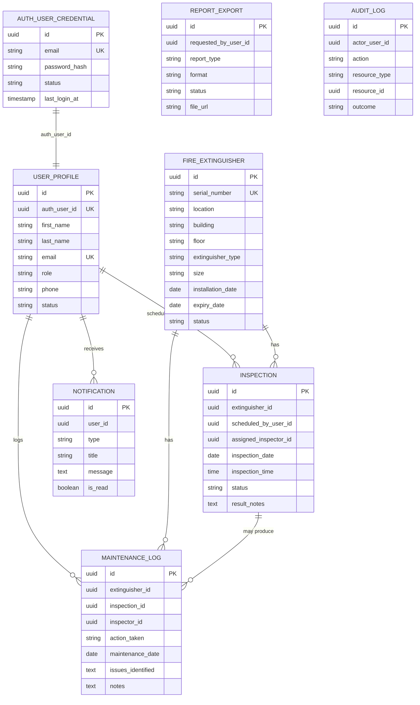

# Fire Extinguisher Management System Architecture

Status: Draft for approval  
Project: TZW LTD Fire Extinguisher Management System  
Target stack: Node.js, Express.js, PostgreSQL, JWT, OpenAPI 3.0, Docker, React

## 1. Requirements Analysis

TZW LTD needs to migrate from a monolithic fire extinguisher management system to RESTful microservices. The main business problems are missed inspections, weak maintenance history tracking, compliance gaps, and limited scalability.

The new system must support:

- User registration, login, JWT authentication, logout, profile management, password changes, and password recovery.
- Role-based access control for Admin, Inspector, and User roles.
- Fire extinguisher registration, listing, details, updates, deletion, and status tracking.
- Inspection scheduling with date, time, assigned personnel, and notifications.
- Maintenance logging with actions taken, issues, notes, and recommendations.
- Real-time reports for inventory, inspections, compliance, and maintenance.
- Report exports in PDF and CSV format.
- OpenAPI 3.0 documentation, health checks, centralized error handling, logging, Docker deployment, and PostgreSQL persistence.

## 2. Proposed Microservices Architecture

The existing template should be specialized from generic service names into domain-specific services.

| Current Template Service | Proposed Service | Port | Responsibility |
| --- | --- | ---: | --- |
| api-gateway | API Gateway | 4000 | Single public entry point, routing, request correlation, auth guard, rate limiting |
| auth-service | Authentication Service | 4001 | Registration, login, JWT issue/validation, password reset, token/session lifecycle |
| user-service | User Management Service | 4002 | User profile data, roles, status, user administration |
| main-service | Fire Extinguisher Service | 4003 | Extinguisher inventory, location, type, size, status, lifecycle dates |
| transaction-service | Inspection & Maintenance Service | 4004 | Inspection scheduling, inspection results, maintenance logs |
| notification-service | Notification Service | 4005 | In-app/email notification records and reminders |
| report-service | Reporting Service | 4006 | Dashboard metrics, compliance reports, exports |
| audit-log-service | Audit Log Service | 4007 | Security and business audit trail |

High-level flow:

```text
React Frontend
  -> API Gateway
      -> Auth Service
      -> User Management Service
      -> Fire Extinguisher Service
      -> Inspection & Maintenance Service
      -> Notification Service
      -> Reporting Service
      -> Audit Log Service
  -> PostgreSQL databases, one database/schema per service
```

## 3. Service Boundaries

### API Gateway

- Routes `/api/auth`, `/api/users`, `/api/extinguishers`, `/api/inspections`, `/api/maintenance`, `/api/notifications`, `/api/reports`, and `/api/audit-logs`.
- Validates JWT for protected routes before proxying.
- Adds `X-Request-Id` to requests.
- Applies CORS, request logging, rate limits, and consistent error responses.
- Does not own business data.

### Authentication Service

- Owns credentials and token/session state.
- Hashes passwords with bcrypt or Argon2.
- Issues short-lived access tokens and optional refresh tokens.
- Supports password recovery tokens.
- Publishes user registration events for user profile creation and notifications.

### User Management Service

- Owns user profile, role, status, and contact metadata.
- Supports Admin user management and current-user profile operations.
- Does not store password hashes.

### Fire Extinguisher Service

- Owns extinguisher inventory data.
- Tracks serial number, location, type, size, installation date, expiry date, status, and assigned building/zone.
- Exposes inventory search and status filtering.
- Emits events when extinguishers are created, updated, expired, or nearing expiry.

### Inspection & Maintenance Service

- Owns inspection schedules, inspection results, and maintenance logs.
- References extinguisher and user IDs from other services.
- Requests extinguisher details from Fire Extinguisher Service when needed.
- Triggers notifications for scheduled, due, overdue, and completed inspections.

### Notification Service

- Owns notification records.
- Sends in-app notifications first; email/SMS can be added behind the same service boundary.
- Supports reminder generation for due inspections and upcoming expirations.

### Reporting Service

- Provides dashboard summaries and downloadable reports.
- Uses synchronous service reads for small real-time reports.
- Can later maintain read models from events for faster analytics.
- Exports CSV and PDF.

### Audit Log Service

- Records authentication, user management, inventory, inspection, maintenance, report export, and admin actions.
- Stores actor ID, action, resource, metadata, request ID, IP address, and outcome.

## 4. Roles and Permissions

| Capability | Admin | Inspector | User |
| --- | :---: | :---: | :---: |
| Manage users | Yes | No | No |
| Manage system settings | Yes | No | No |
| Register/update/delete extinguishers | Yes | Limited update | No |
| View extinguisher status | Yes | Yes | Yes |
| Schedule inspections | Yes | Yes | Yes |
| Conduct inspections | Yes | Yes | No |
| Log maintenance | Yes | Yes | No |
| View inspection history | Yes | Yes | Own/allowed locations |
| View reports | Yes | Operational reports | Limited |
| Export reports | Yes | Yes | No |

## 5. ERD

Logical ERD across service-owned databases:



Note: Cross-service relationships are logical references by UUID, not enforced with database foreign keys across separate service databases.

## 6. Database Schemas

Each service should use its own PostgreSQL database or at minimum its own schema. UUID primary keys are recommended to make cross-service references safer.

### auth_db

| Table | Key Columns | Notes |
| --- | --- | --- |
| user_credentials | id, email, password_hash, status, last_login_at, created_at, updated_at | Unique email; status enum: ACTIVE, DISABLED, LOCKED |
| refresh_tokens | id, user_id, token_hash, expires_at, revoked_at, created_at | Index user_id; hash stored token |
| password_reset_tokens | id, user_id, token_hash, expires_at, used_at, created_at | Short expiry; one-time use |

Indexes:

- `user_credentials(email)` unique
- `refresh_tokens(user_id, expires_at)`
- `password_reset_tokens(user_id, expires_at)`

### user_db

| Table | Key Columns | Notes |
| --- | --- | --- |
| user_profiles | id, auth_user_id, first_name, last_name, email, role, phone, status, created_at, updated_at | Role enum: ADMIN, INSPECTOR, USER |
| user_locations | id, user_id, building, floor, zone, created_at | Optional access scoping |

Indexes:

- `user_profiles(auth_user_id)` unique
- `user_profiles(email)` unique
- `user_profiles(role, status)`

### extinguisher_db

| Table | Key Columns | Notes |
| --- | --- | --- |
| fire_extinguishers | id, serial_number, location, building, floor, zone, type, size, installation_date, expiry_date, status, created_at, updated_at | Type enum: WATER, CO2, FOAM, DRY_CHEMICAL |
| extinguisher_status_history | id, extinguisher_id, old_status, new_status, reason, changed_by_user_id, created_at | Local FK to fire_extinguishers |

Constraints:

- `serial_number` unique and required
- `expiry_date > installation_date`
- `size` in `1.5 lb`, `5 lb`, `9 lb`, `12 lb`
- `status` in `ACTIVE`, `DUE_FOR_INSPECTION`, `UNDER_MAINTENANCE`, `EXPIRED`, `RETIRED`

Indexes:

- `fire_extinguishers(serial_number)` unique
- `fire_extinguishers(status)`
- `fire_extinguishers(expiry_date)`
- `fire_extinguishers(building, floor, zone)`

### inspection_db

| Table | Key Columns | Notes |
| --- | --- | --- |
| inspections | id, extinguisher_id, scheduled_by_user_id, assigned_inspector_id, inspection_date, inspection_time, status, result, result_notes, completed_at, created_at, updated_at | References external service IDs |
| maintenance_logs | id, extinguisher_id, inspection_id, inspector_id, action_taken, maintenance_date, issues_identified, notes, recommendations, created_at | Inspection ID optional |

Constraints:

- `inspection_date` required
- `status` in `SCHEDULED`, `COMPLETED`, `CANCELLED`, `OVERDUE`
- `result` in `PASS`, `FAIL`, `NEEDS_MAINTENANCE`, `NOT_APPLICABLE`

Indexes:

- `inspections(extinguisher_id, inspection_date)`
- `inspections(assigned_inspector_id, status)`
- `inspections(status, inspection_date)`
- `maintenance_logs(extinguisher_id, maintenance_date)`

### notification_db

| Table | Key Columns | Notes |
| --- | --- | --- |
| notifications | id, user_id, type, title, message, channel, is_read, read_at, metadata, created_at | JSON metadata |
| notification_delivery_attempts | id, notification_id, channel, status, error_message, attempted_at | Delivery tracking |

Indexes:

- `notifications(user_id, is_read, created_at)`
- `notifications(type, created_at)`

### report_db

| Table | Key Columns | Notes |
| --- | --- | --- |
| report_exports | id, requested_by_user_id, report_type, format, filters, status, file_url, error_message, created_at, completed_at | JSON filters |
| report_snapshots | id, report_type, period_start, period_end, metrics, created_at | Optional read model/cache |

Indexes:

- `report_exports(requested_by_user_id, created_at)`
- `report_exports(report_type, format)`
- `report_snapshots(report_type, period_start, period_end)`

### audit_log_db

| Table | Key Columns | Notes |
| --- | --- | --- |
| audit_logs | id, request_id, actor_user_id, action, resource_type, resource_id, outcome, ip_address, user_agent, metadata, created_at | Immutable append-only table |

Indexes:

- `audit_logs(actor_user_id, created_at)`
- `audit_logs(resource_type, resource_id)`
- `audit_logs(request_id)`
- `audit_logs(action, created_at)`

## 7. Service-to-Service Communication

Use synchronous REST for direct user-facing reads and asynchronous events for side effects.

Synchronous REST:

- API Gateway routes client requests to the owning service.
- Inspection Service calls Fire Extinguisher Service to validate an extinguisher exists before scheduling.
- Inspection Service calls User Service to validate an assigned inspector.
- Reporting Service calls domain services for real-time summaries until read models are introduced.

Asynchronous events:

- `UserRegistered`
- `FireExtinguisherCreated`
- `FireExtinguisherStatusChanged`
- `InspectionScheduled`
- `InspectionCompleted`
- `InspectionOverdue`
- `MaintenanceLogged`
- `ReportExportRequested`

Recommended first implementation:

- Use REST plus database records for notifications/audits to keep the initial build simple.
- Add a message broker such as RabbitMQ, NATS, or Kafka in a later scaling phase.

## 8. REST API Contracts

All endpoints are exposed through the API Gateway under `/api`.

Common response shape:

```json
{
  "success": true,
  "data": {},
  "message": "Operation completed"
}
```

Common error shape:

```json
{
  "success": false,
  "error": {
    "code": "VALIDATION_ERROR",
    "message": "Invalid request data",
    "details": []
  }
}
```

### Authentication Service

| Method | Path | Auth | Purpose |
| --- | --- | --- | --- |
| POST | `/api/auth/register` | Public | Register user with first name, last name, email, password |
| POST | `/api/auth/login` | Public | Authenticate and issue JWT |
| POST | `/api/auth/logout` | User | Revoke refresh token/session |
| POST | `/api/auth/refresh` | Public | Issue new access token |
| POST | `/api/auth/validate` | Service/API Gateway | Validate token |
| POST | `/api/auth/forgot-password` | Public | Request password reset |
| POST | `/api/auth/reset-password` | Public | Reset password with token |
| POST | `/api/auth/change-password` | User | Change current password |
| GET | `/api/auth/health` | Public | Health check |

### User Management Service

| Method | Path | Auth | Purpose |
| --- | --- | --- | --- |
| GET | `/api/users` | Admin | List users |
| POST | `/api/users` | Admin | Create user profile |
| GET | `/api/users/me` | User | View own profile |
| PUT | `/api/users/me` | User | Update own profile |
| GET | `/api/users/{id}` | Admin | View user |
| PUT | `/api/users/{id}` | Admin | Update user |
| PATCH | `/api/users/{id}/role` | Admin | Change role |
| PATCH | `/api/users/{id}/status` | Admin | Enable/disable user |
| DELETE | `/api/users/{id}` | Admin | Soft-delete or deactivate user |
| GET | `/api/users/health` | Public | Health check |

### Fire Extinguisher Service

| Method | Path | Auth | Purpose |
| --- | --- | --- | --- |
| POST | `/api/extinguishers` | Admin | Register extinguisher |
| GET | `/api/extinguishers` | User | List/search extinguishers |
| GET | `/api/extinguishers/{id}` | User | View details |
| PUT | `/api/extinguishers/{id}` | Admin/Inspector | Update details |
| PATCH | `/api/extinguishers/{id}/status` | Admin/Inspector | Update status |
| DELETE | `/api/extinguishers/{id}` | Admin | Retire/delete extinguisher |
| GET | `/api/extinguishers/health` | Public | Health check |

Query filters:

- `status`
- `type`
- `building`
- `floor`
- `zone`
- `expiryBefore`
- `search`
- `page`
- `limit`

### Inspection & Maintenance Service

| Method | Path | Auth | Purpose |
| --- | --- | --- | --- |
| POST | `/api/inspections` | Admin/Inspector/User | Schedule inspection |
| GET | `/api/inspections` | User | List inspections |
| GET | `/api/inspections/{id}` | User | View inspection |
| PUT | `/api/inspections/{id}` | Admin/Inspector | Reschedule/update inspection |
| PATCH | `/api/inspections/{id}/complete` | Inspector | Log inspection result |
| PATCH | `/api/inspections/{id}/cancel` | Admin/Inspector | Cancel inspection |
| POST | `/api/maintenance` | Inspector | Log maintenance |
| GET | `/api/maintenance` | User | List maintenance logs |
| GET | `/api/maintenance/{id}` | User | View maintenance log |
| GET | `/api/inspections/health` | Public | Health check |

### Notification Service

| Method | Path | Auth | Purpose |
| --- | --- | --- | --- |
| GET | `/api/notifications` | User | List own notifications |
| POST | `/api/notifications` | Service/Admin | Create notification |
| PATCH | `/api/notifications/{id}/read` | User | Mark as read |
| PATCH | `/api/notifications/read-all` | User | Mark all as read |
| GET | `/api/notifications/health` | Public | Health check |

### Reporting Service

| Method | Path | Auth | Purpose |
| --- | --- | --- | --- |
| GET | `/api/reports/dashboard` | User | Summary dashboard metrics |
| GET | `/api/reports/inventory` | Admin/Inspector | Inventory reports |
| GET | `/api/reports/inspections` | Admin/Inspector | Pending/completed/overdue reports |
| GET | `/api/reports/compliance` | Admin/Inspector | Expired/upcoming/compliance status |
| GET | `/api/reports/maintenance` | Admin/Inspector | Maintenance history/frequency |
| POST | `/api/reports/exports` | Admin/Inspector | Create CSV/PDF export |
| GET | `/api/reports/exports/{id}` | Admin/Inspector | Get export status/download URL |
| GET | `/api/reports/health` | Public | Health check |

### Audit Log Service

| Method | Path | Auth | Purpose |
| --- | --- | --- | --- |
| POST | `/api/audit-logs` | Service | Create audit log |
| GET | `/api/audit-logs` | Admin | Search audit logs |
| GET | `/api/audit-logs/{id}` | Admin | View audit log |
| GET | `/api/audit-logs/health` | Public | Health check |

## 9. OpenAPI 3.0 Specification Strategy

Each service should own an OpenAPI document, and the API Gateway should expose a combined documentation route.

Recommended files:

- `backend/services/auth-service/openapi.yaml`
- `backend/services/user-service/openapi.yaml`
- `backend/services/extinguisher-service/openapi.yaml`
- `backend/services/inspection-service/openapi.yaml`
- `backend/services/notification-service/openapi.yaml`
- `backend/services/report-service/openapi.yaml`
- `backend/services/audit-log-service/openapi.yaml`

Required OpenAPI components:

- `BearerAuth` security scheme using JWT.
- Shared `ErrorResponse`, `PaginationMeta`, and role-protected endpoint descriptions.
- Request schemas for registration, login, extinguisher registration, inspection scheduling, maintenance logging, and report export.
- Response schemas for users, extinguishers, inspections, maintenance logs, notifications, and reports.

Example OpenAPI path shape:

```yaml
openapi: 3.0.3
info:
  title: Fire Extinguisher Service API
  version: 1.0.0
paths:
  /api/extinguishers:
    get:
      summary: List fire extinguishers
      security:
        - BearerAuth: []
      parameters:
        - in: query
          name: status
          schema:
            type: string
      responses:
        "200":
          description: Fire extinguisher list
    post:
      summary: Register a fire extinguisher
      security:
        - BearerAuth: []
      responses:
        "201":
          description: Fire extinguisher created
components:
  securitySchemes:
    BearerAuth:
      type: http
      scheme: bearer
      bearerFormat: JWT
```

## 10. Clean Architecture Structure

Each service should follow a consistent module layout:

```text
src/
  app.js
  config/
  domain/
    entities/
    value-objects/
  application/
    use-cases/
    dto/
  infrastructure/
    database/
    repositories/
    http/
  interfaces/
    controllers/
    routes/
    middleware/
  validations/
  utils/
```

Dependency direction:

- Routes/controllers depend on application use cases.
- Use cases depend on repository interfaces.
- Infrastructure implements repository interfaces.
- Domain entities do not depend on Express, PostgreSQL, or JWT libraries.

## 11. Security Design

- Hash passwords with bcrypt or Argon2.
- Use JWT access tokens with short expiry.
- Store refresh tokens as hashes with expiry and revocation.
- Enforce RBAC at gateway and service levels.
- Validate request payloads with Joi, Zod, or express-validator.
- Use helmet, CORS allowlists, rate limiting, and request size limits.
- Do not log passwords, raw tokens, or reset tokens.
- Use centralized error middleware to avoid leaking stack traces.
- Add audit logs for login attempts, user changes, extinguisher deletion, inspection completion, maintenance logging, and report exports.

## 12. Logging and Observability

- Use request IDs across API Gateway and services.
- Log method, path, status, latency, request ID, user ID where available, and service name.
- Keep business audit logs separate from technical logs.
- Add `/health` endpoint to every service.
- Add `/ready` endpoint when database readiness checks are implemented.

Health response:

```json
{
  "status": "ok",
  "service": "extinguisher-service",
  "timestamp": "2026-06-03T00:00:00.000Z"
}
```

## 13. Frontend Screen Plan

The React frontend should be renamed and reorganized around the fire safety domain.

Screens:

- Registration form: first name, last name, email, password, confirm password.
- Login form: email and password.
- Dashboard: inventory count, overdue inspections, upcoming expirations, maintenance activity, compliance status.
- Fire Extinguisher Management: searchable table, create/edit modal/form, status filters.
- Extinguisher Details: status, location, lifecycle dates, inspection history, maintenance history.
- Inspection Scheduling: extinguisher selector, inspector selector, date, time, notes.
- Maintenance Logging: action taken, issues, notes, recommendations.
- Reports: inventory, inspection, compliance, maintenance, PDF/CSV export actions.
- Notifications: unread reminders and system messages.
- User Management: admin-only user list, role/status controls.

Navigation should become:

- Dashboard
- Fire Extinguishers
- Inspections
- Maintenance
- Notifications
- Reports
- Users

## 14. Implementation Roadmap

### Phase 1: Architecture Approval

- Review and approve service boundaries.
- Confirm ORM choice: Prisma is recommended for clear schemas and migrations; Sequelize is acceptable if matching existing template style is preferred.
- Confirm event broker timing: initial REST-only build or add RabbitMQ from the start.
- Confirm frontend scope for first delivery.

### Phase 2: Foundation

- Rename generic services and routes to domain names.
- Add shared environment standards.
- Add health checks.
- Add request ID middleware, error middleware, validation middleware, and logging.
- Add OpenAPI files per service.

### Phase 3: Authentication and Users

- Implement registration with first name, last name, email, and password.
- Add duplicate email prevention and secure password hashing.
- Implement login, logout, token refresh, token validation, password change, and password recovery.
- Implement roles: Admin, Inspector, User.
- Implement user profile APIs.

### Phase 4: Fire Extinguisher Inventory

- Implement extinguisher database schema and migrations.
- Implement CRUD endpoints.
- Add filters, pagination, status history, validation, and audit logging.

### Phase 5: Inspection and Maintenance

- Implement inspection scheduling.
- Implement inspection completion flow.
- Implement overdue detection.
- Implement maintenance logging.
- Trigger notifications for scheduled and overdue inspections.

### Phase 6: Reporting

- Implement inventory, inspection, compliance, and maintenance reports.
- Add dashboard metrics.
- Add PDF and CSV export.
- Store report export metadata.

### Phase 7: Frontend

- Rename generic UI labels to fire extinguisher domain.
- Add registration/login flows.
- Add dashboard, extinguisher, inspection, maintenance, report, notification, and user pages.
- Add role-based navigation and route protection.

### Phase 8: Testing and Deployment

- Add unit tests for use cases and validation.
- Add integration tests for REST endpoints.
- Add API Gateway routing tests.
- Add OpenAPI validation.
- Add Docker Compose verification.
- Add database export and backup scripts.

## 15. Approval Questions

Please approve or adjust these decisions before implementation:

1. Use Prisma ORM for new service schemas and migrations, or keep the existing raw SQL/Sequelize-style template?
2. Rename `main-service` to `extinguisher-service` and `transaction-service` to `inspection-service`?
3. Start with REST-only service communication and add a message broker later?
4. Keep the existing `audit-log-service` as an extra compliance/security service?
5. Build the frontend domain conversion in the same implementation phase as the backend, or after backend APIs are stable?

No application code should be generated until these architecture choices are approved.
